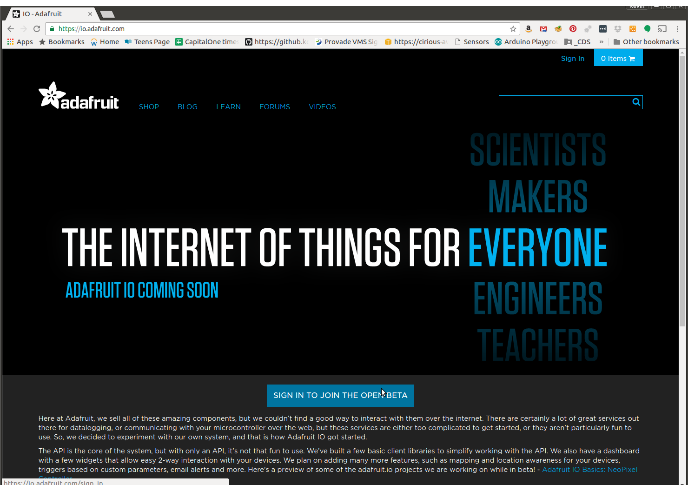
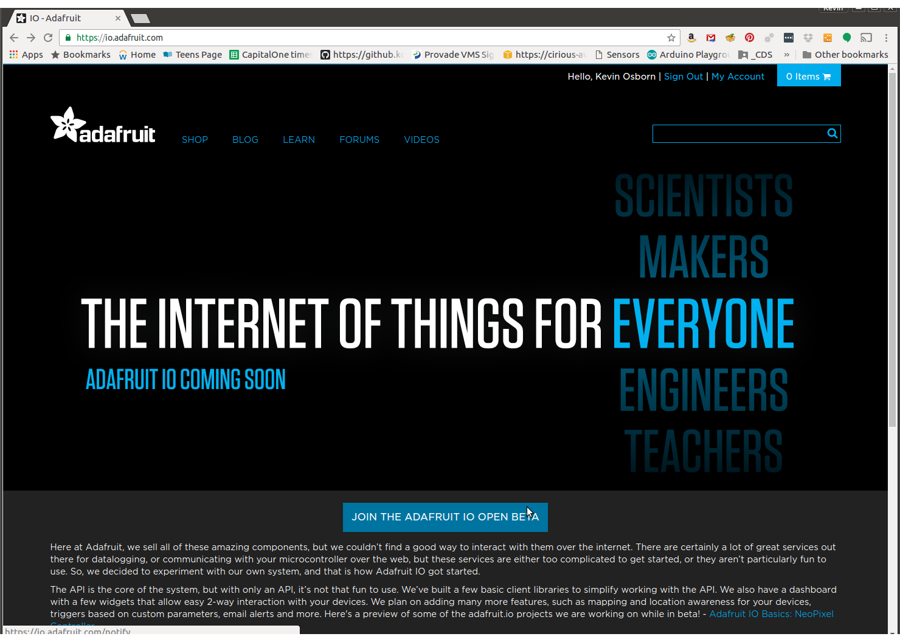
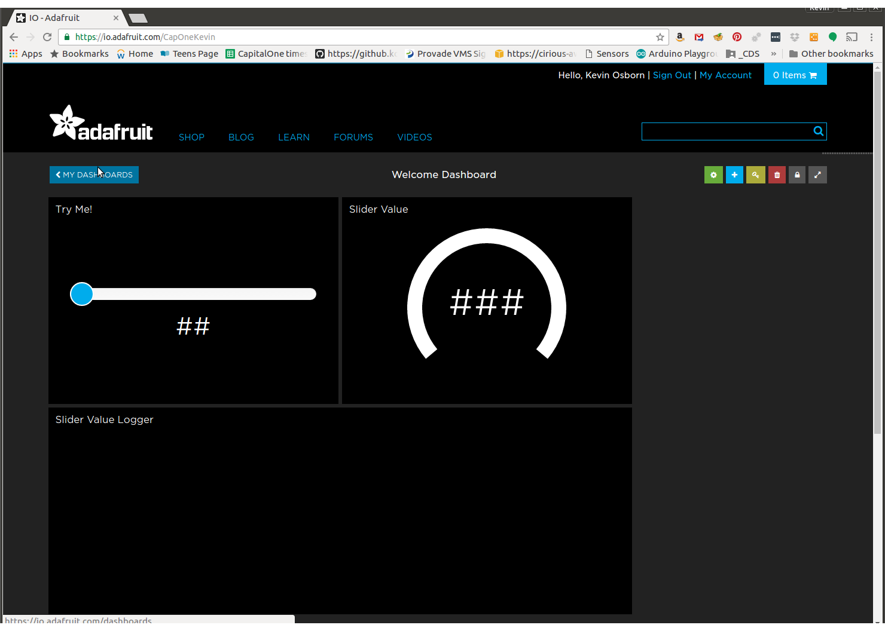
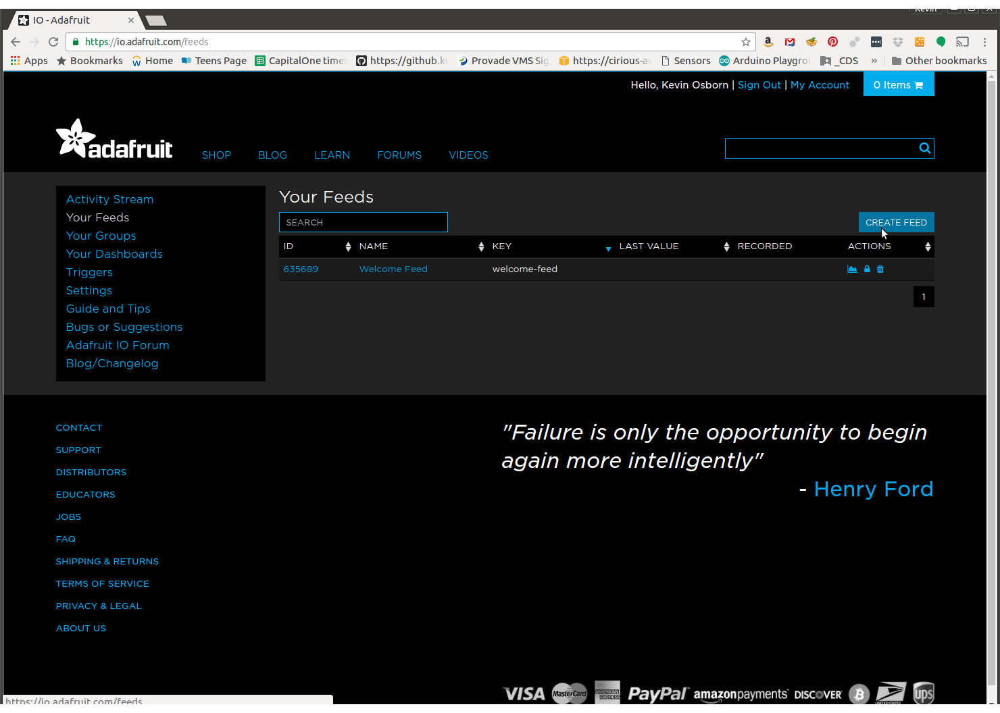
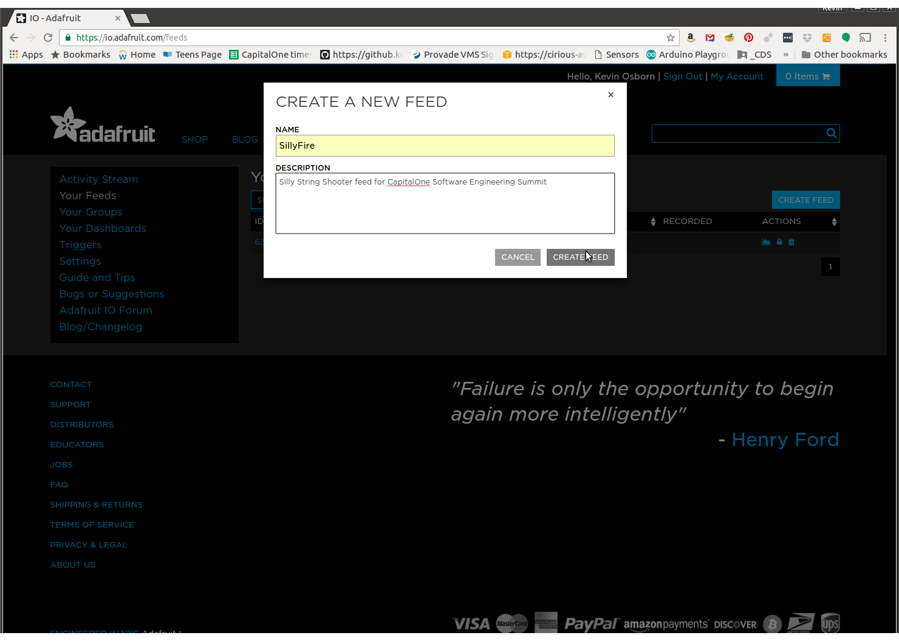
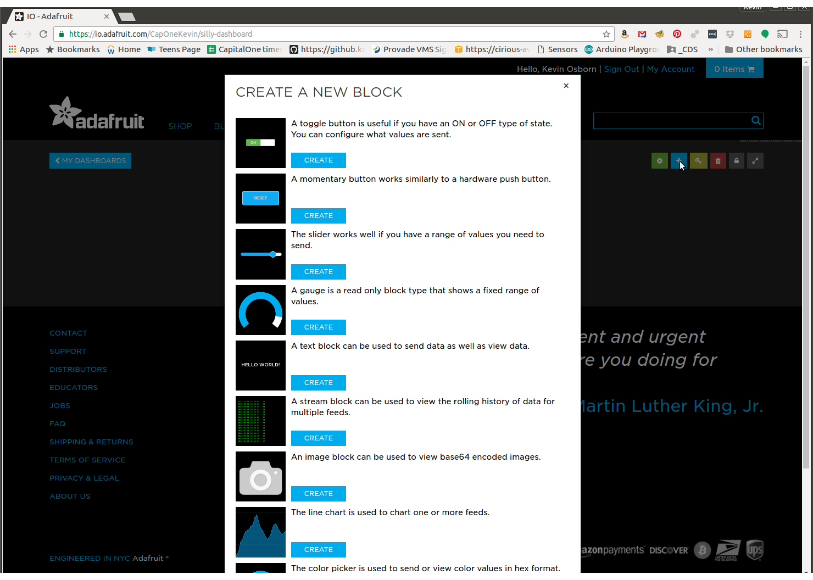
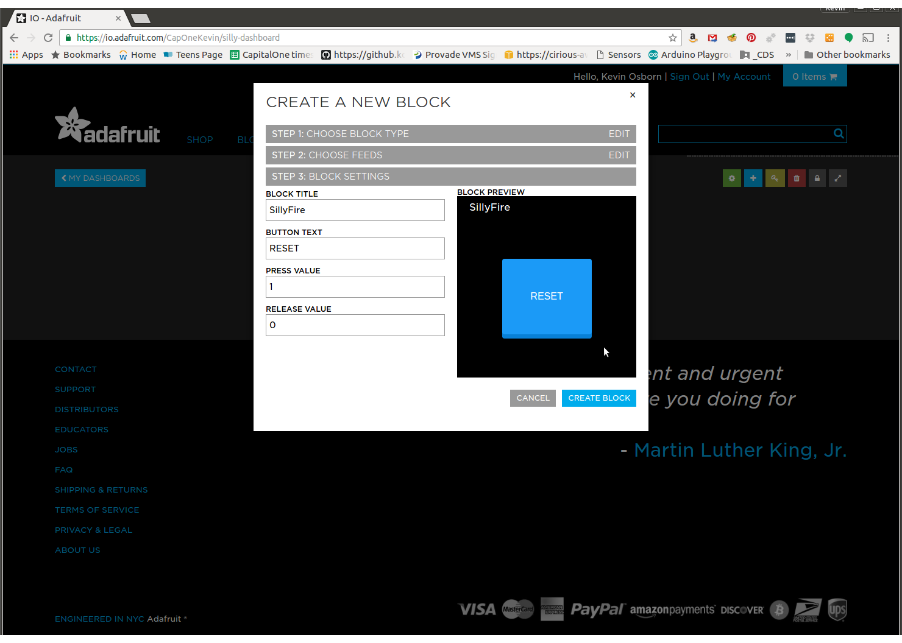

# Adafruit IO setup for SillyString shooter project
First get an account at Adafruit.com.
Then go to io.adafruit.com

You'll need to click joinbeta after signing in.

This takes us to the default dashboard, navigate away by clickin on "Dashboards"

Go to Your Feeds:

Create a feed called SillyFire

Now go back to dashboards and create a new dashboard
Click on Create Dashboard
Once there, click on the plus to create a new block/control
The wizard will walk you through. You can also create new feeds here, but in our case, we'll select SillyFire.

Pick button, and make yourself a fire button

