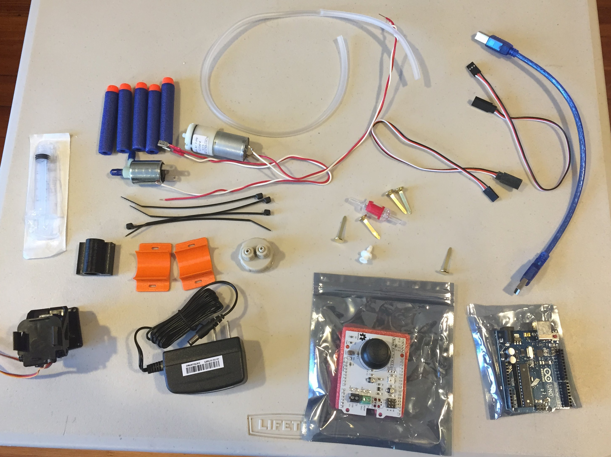

# Hardware Assembly
This is what the fully assembled kit will look like when we are finished

## Unpack your kit
Layout the contents on a table, putting like things together

## Solenoid and pump preparation. Preparation

First perpare your gas solenoid (electronically controlled air release valve).
Take off the blue caps from the inputs/outputs of the valve

Attach the leads to the contact tabs on the back of the valve. They are tight so some force is required, but be careful not o bend or break the connectors.

Feed the Zip ties through the channels in the bottom of one of the 3D printed holders. Note the orientation of the zip tie. Do this for both channels (x2)

Place the Solenoid valve in the cradle, and fasten the zip ties around it, tighten and clip off the excess.

Prepare the other cradle the same way and fasten the pump to it.

## Barrel assembly
Remove the plunger from the 5ml Syringe. Discard (unless you can think of a cool use...)

Slip the syringe into the barrel holder 3D printed part and snap into the Pan-tilt mechanism. Note that the "handle end" of the syringe (front of the barrel) points away from where the leads come out of the pan-tilt.

If you have a Luer style syringe, install the Luer to hose barb adapter. It screws in

