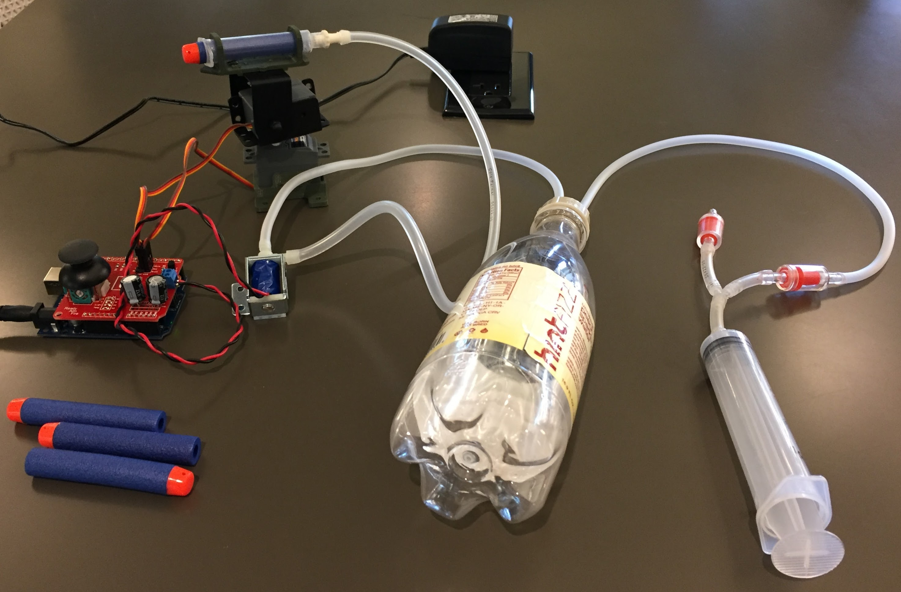

# RAF - Ready...Aim...Fire!
Software for a beginning programming class with Arduino, and IOT programming with MQTT. Hardware consists of an Arduino, Shield, Pan/tilt mechanism and pneumatic components for firing foam darts

## Instructions
 * [Assembly Instructions](./Documents/Assembly.md)
 * [Software setup](./Documents/Software.md)

## Software requirements
 * Arduino IDE
 * Python 2.7
 * Adafruit IOT python package

## Hardware components
Qty,Per student BOM
 * 1,Arduino
 * 1,ArduLauncher shield
 * 2,Servos (pan tilt mechanism)
 * 1,Gas solenoid valve
 * 1,Solenoid power supply (not needed if we go with 5V servos
 * 1,USB cable for Arduino
 * 2ft,2 ft of air tubing
 * 1,2 barb bottle cap
 * 1,Barrel (3 ml Syringe)
 * 1,Pan Tilt Mechanism parts
 * 1,[Hardware for pan tilt mechanism.](http://www.lynxmotion.com/p-288-lynx-b-pan-and-tilt-kit-black-anodized-no-servos.aspx)
 * 5,foarm darts
 * 1,Soda bottle for air tank
 * 1,30 ml syringe
 * 2,[2x one way valves](https://www.amazon.com/Jardin-Plastic-Aquarium-Valves-2-Piece/dp/B00880E1ZY)
 * 2,"2x luer - 1/8"" hose barb adapters"
 * 1,[hose barb tee](https://www.amazon.com/TOOGOO-Plastic-Shape-Aquarium-Connectors/dp/B01N25ILNK)
 * 1,Bottle holder
 * 1,Foam core for base
 * X,Paper fasteners
